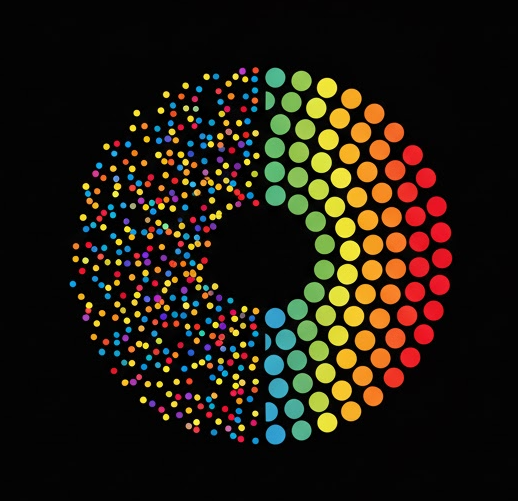

# Sort Moments



**Organize your photos by faces using AI**

A free, open-source desktop application that automatically groups your photos by the people in them using advanced face detection and recognition.

<video src="demo_video.mp4" controls width="640">
Your browser does not support the video tag.
</video>

[Download](https://sortmoments.com) | [Website](https://sortmoments.com) | [Report Issues](https://github.com/DarthAmk97/SortMoments/issues)

---

## Features

- **AI-Powered Face Detection** - Uses InsightFace with the buffalo_l model for accurate face detection and recognition
- **Automatic Grouping** - Photos are automatically grouped by person based on face similarity
- **GPU Accelerated** - Supports DirectML (any GPU on Windows), CUDA, or CPU fallback
- **Privacy First** - All processing happens locally on your machine. No data leaves your computer
- **Modern Interface** - Clean, dark-themed PyQt6 interface with progress tracking
- **Free & Open Source** - MIT licensed, free forever

---

## Quick Start

### Option 1: Download Pre-built Executable (Recommended)

1. Download `SortMoments.exe` from [sortmoments.com](https://sortmoments.com) or [GitHub Releases](https://github.com/DarthAmk97/SortMoments/releases)
2. Run the executable (no installation required)
3. Drag & drop a folder containing your photos
4. Click "Start Processing"
5. Done! Your photos are organized by person

### Option 2: Run from Source

```bash
# Clone the repository
git clone https://github.com/DarthAmk97/SortMoments.git
cd SortMoments

# Create virtual environment (recommended)
python -m venv venv
venv\Scripts\activate  # Windows
# source venv/bin/activate  # macOS/Linux

# Install dependencies
pip install -r requirements.txt

# Run the application
python photo_organizer.py
```

### Option 3: Build Your Own Executable

See [BUILDING.md](BUILDING.md) for detailed build instructions.

---

## System Requirements

- **OS**: Windows 10/11 (64-bit)
- **RAM**: 4GB minimum, 8GB+ recommended
- **Storage**: ~1GB for the application + space for your photos
- **GPU**: Optional but recommended for faster processing
  - Any DirectX 12 compatible GPU (NVIDIA, AMD, Intel)
  - NVIDIA CUDA-capable GPU for best performance

---

## How It Works

1. **Face Detection** - Scans all images in your folder and detects faces
2. **Embedding Creation** - Creates a unique mathematical representation for each face
3. **Clustering** - Groups similar faces together (same person)
4. **Organization** - Copies photos into person-specific folders

---

## Output Structure

After processing, photos are organized in an `all_images_processed/` folder:

```
your_photos_folder/
└── all_images_processed/
    ├── rename_0/                    # Person 1
    │   ├── rename_0_representative_face.jpg
    │   ├── photo1.jpg
    │   └── photo2.jpg
    ├── rename_1/                    # Person 2
    │   ├── rename_1_representative_face.jpg
    │   └── photo3.jpg
    ├── all_group_photos/            # Photos with 3+ people
    │   └── group_photo.jpg
    └── README.txt
```

You can rename the folders to actual person names directly in the app!

---

## Tech Stack

- **GUI**: PyQt6
- **Face Detection/Recognition**: InsightFace (buffalo_l model)
- **Image Processing**: OpenCV, Pillow
- **GPU Acceleration**: ONNX Runtime with DirectML/CUDA
- **Build Tool**: PyInstaller

---

## Troubleshooting

### "Missing Dependencies" warning
```bash
pip install -r requirements.txt
```

### InsightFace model download issues
The model downloads automatically on first run. If issues occur:
```bash
python -c "from insightface.app import FaceAnalysis; app = FaceAnalysis('buffalo_l'); app.prepare(ctx_id=-1)"
```

### Processing is slow
- Ensure GPU acceleration is being used (check console output)
- Processing time depends on the number and resolution of images
- First run may be slower due to model loading

### Error during processing
- Click "Send Error Logs" button to report the issue
- Check the log file location shown in the error dialog

---

## Contributing

Contributions are welcome! Please feel free to submit a Pull Request.

1. Fork the repository
2. Create your feature branch (`git checkout -b feature/AmazingFeature`)
3. Commit your changes (`git commit -m 'Add some AmazingFeature'`)
4. Push to the branch (`git push origin feature/AmazingFeature`)
5. Open a Pull Request

---

## License

This project is licensed under the MIT License - see the [LICENSE](LICENSE) file for details.

---

## Acknowledgments

- [InsightFace](https://github.com/deepinsight/insightface) for face detection and recognition
- [PyQt6](https://www.riverbankcomputing.com/software/pyqt/) for the GUI framework
- [ONNX Runtime](https://onnxruntime.ai/) for GPU acceleration

---

Made with care by Abdullah Khawaja with dearest collabortator Claude Code
